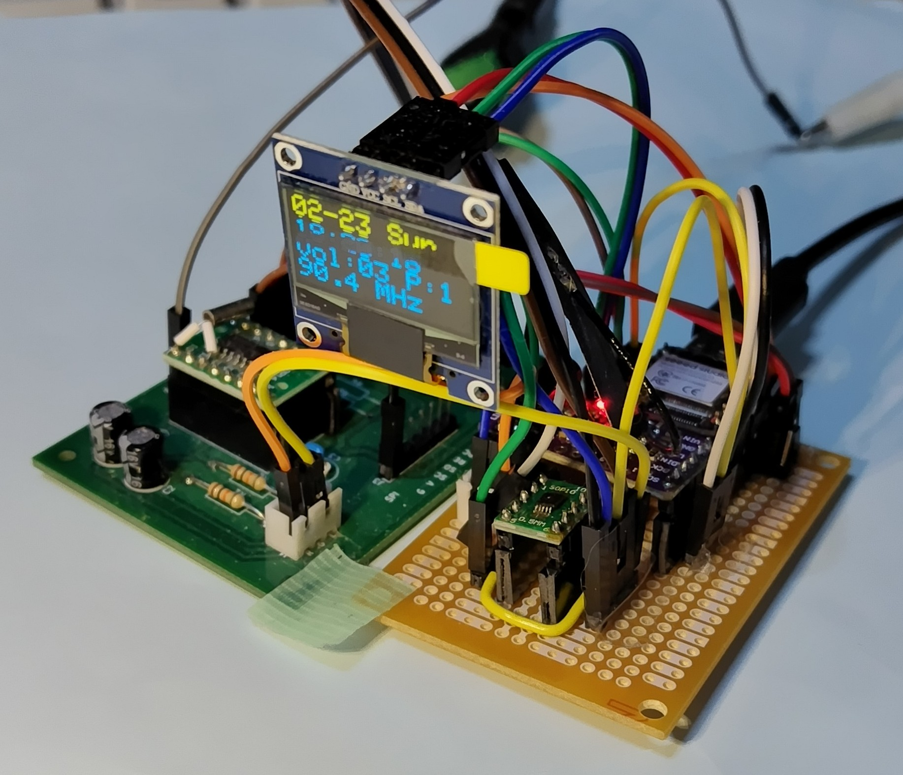
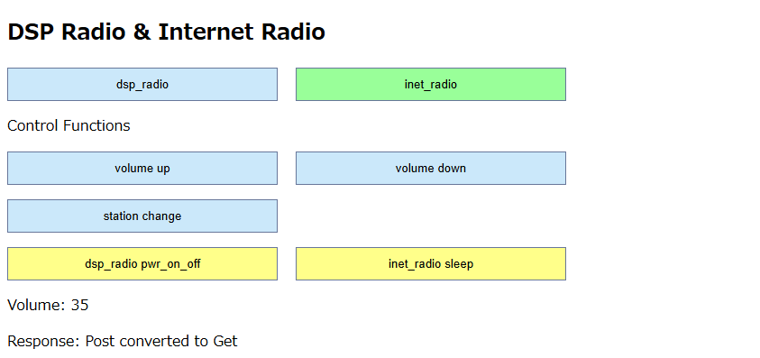
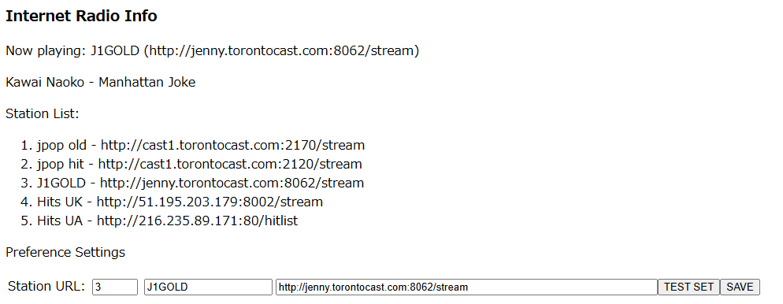
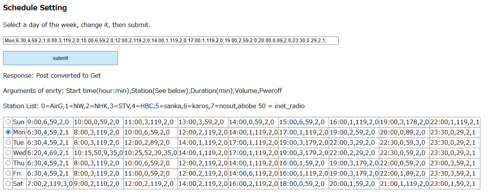

<H3>週間スケジュールが可能なDSPラジオ(RDA5807)とインターネットラジオ(PCM5102)を合体したセット（プロトタイプ）</H3>

予め設定した週間スケジュールに基づいて番組を聴くことができる、FM DSPラジオとインターネットラジオを合体したセットを試作したので紹介する。 
DSPラジオにはRDA5807FPを利用した（<a href="https://www.aitendo.com/product/4797">データシートの参照リンクあり</a>）。 
インターネットラジオにはPCM5102を利用している。 
両者を合体し、<a href="https://www.switch-science.com/products/8968">Seeed Studio XIAO ESP32S3</a>で制御する。 
操作には、Webブラウザを使用する。 開発はArduino IDE 2.1で行った。 
使用したRDA5807用のライブラリは、<a href="https://github.com/pu2clr/RDA5807">こちら（pu2clr at GitHub）</a>にある。 
なお、Arduino IDEのライブラリ管理からもインストール可能である。 
I2SのライブラリaudioI2Sは、<a href="https://github.com/schreibfaul1/ESP32-audioI2S  ">こちら（GitHub）</a>を利用している。

<strong>機能</strong> 
 ・FMラジオとインターネットラジオを切替え可能。出力切替えには　アナログスイッチADG884 を利用している。 
 ・週間スケジュールを設定できる。曜日ごとに、開始時間、長さ（分）、ラジオ局又はインターネットラジオ局の番号、音量、終了後ON/OFFを設定する。 
 ・ラジオ局とインターネットラジオ局の区別は番号で行う。50以上をインターネットラジオ局と判断し、50を引いてインターネットラジオ局の番号とする。 
 ・週間スケジュールの設定は、PC、スマホ等のブラウザからXIAO ESP32S3にアクセスして行う。 
 ・同様に、ラジオ局又はインターネットラジオ局の選局、音量の変更、ラジオのON/OFFは、ブラウザから行うことができる。 
 ・週間スケジュールの設定により、目覚まし機能、スリープ機能が可能である。 
 ・OLED表示装置に、日付、曜日、時刻、音量、ラジオのON/OFF、受信周波数、インターネットラジオ局の情報を表示する。 
 ・XIAO ESP32S3の特定のピンにタクトスイッチを接続すれば、選局、音量調節、スリープが可能である。 
 ・受信周波数の範囲は、76－108MHzで、ワイドFM対応である。 
 ・出力はオーディオジャック経由で小口径のスピーカー（ステレオ）を接続する。 

<strong>H/W構成</strong> 
 ・Seeed Studio XIAO ESP32S3 - コントローラ 
 ・I2C接続&nbsp; RDA5807FP 
 ・I2S接続&nbsp; PCM5102　(UDA1334でも可) 
 ・I2C接続&nbsp; SSD1306 64x32 OLED表示装置 
 ・出力切替え&nbsp; ADG884 アナログスイッチ 
 ・Xtal発振器（32768Hz）、コンデンサ、抵抗類、オーディオジャック、配線類 

<strong>接続</strong> 
各コンポーネントの接続は回路図を参照のこと。 
プルアップ抵抗（R3,R4）は配線の長さに注意すれば省略可。 
J5はRF_GNDをGNDにジャンパ接続する。 
SW1はスリープ機能である。 

 

<strong>インストール</strong> 
<ol>
<li>コードを、ZIP形式でダウンロード、適当なフォルダに展開する。</li>
<li>ArduinoIDEにおいて、ライブラリマネージャから以下を検索してインストールする</li>
 <ul>
  <li>Adafruit_BusIO</li>
  <li>Adafruit_GFX</li>
  <li>Adafruit_SSD1306</li>
  <li>RDA5807</li>
 </ul>
<li>追加のライブラリを、ZIP形式でダウンロード、ライブラリマネージャからインストールする</li>
 <ul>
  <li>TimeLib&nbsp;:&nbsp; https://github.com/PaulStoffregen/Time</li>
  <li>Audio　-　audioI2S</li>
 </ul>
<li>ArduinoIDEからxiao_esp32s3_ssd1306_i_d_radio_master.inoを開く</li>
<li>「検証・コンパイル」に成功したら、一旦、「名前を付けて保存」を行う</li>
<li>利用するWiFiのアクセスポイントに合わせて、スケッチのssid、passwordを編集する。</li>
<li>ローカルのラジオ局の周波数"stnFreq"と局名"stnName"を設定する。</li>
</ol>

<strong>ブラウザの画面</strong> 

操作 
 

インターネットラジオ 
 

スケジュール 
 

<strong>注意事項</strong> 
・一通りの動作は確認していますが、試作なので細かいところまでは確認しておりません。 
・動作を保証するものではありませんので、利用の際は、自己責任でお楽しみください。

